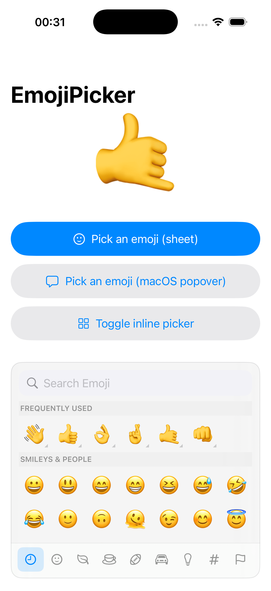
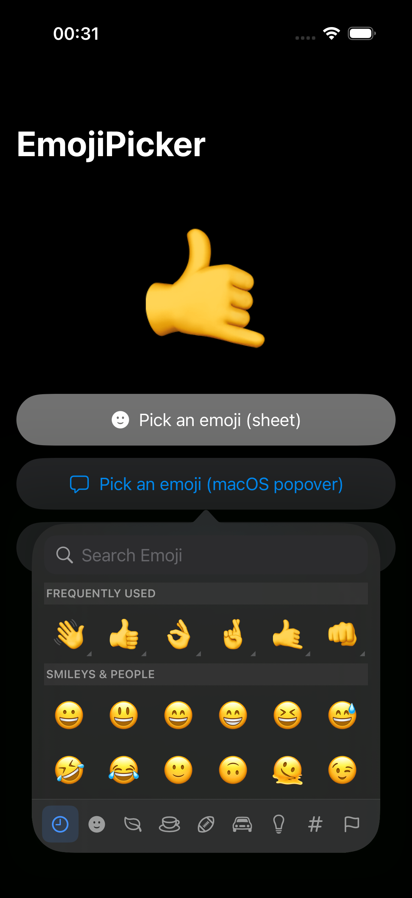
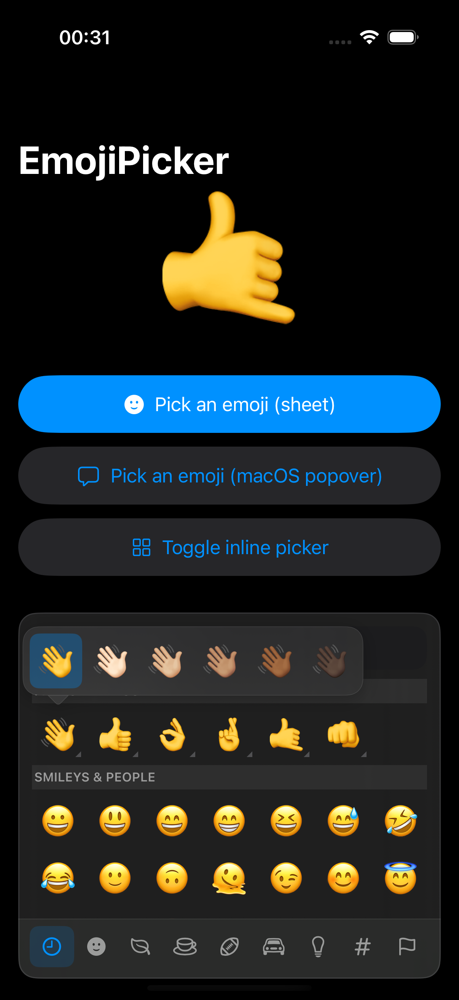

# EmojiPicker

A lightweight, **100% SwiftUI** emoji picker for iOS 15+, inspired by the macOS
emoji panel. No UIKit view controllers, no external dependencies — present it as
a sheet, a native popover, or embed it inline.

<p align="center">
  
  &nbsp;
  
  &nbsp;
  
</p>

## Features

- 🧩 **Pure SwiftUI** — embeddable view, a sheet modifier, and a popover modifier. No `UIViewControllerRepresentable`.
- 🎯 **macOS-style popover** — SwiftUI's native popover: an arrow anchored to your button on iPad (all versions) and iPhone (iOS 16.4+), with a graceful sheet fallback on older iPhones.
- 🌗 **Translucent & theme-aware** — `.ultraThinMaterial` backdrop by default, adapting to light/dark.
- 🗂️ **8 categories** with a macOS-style scrolling grid, sticky headers, and a synced tab bar.
- 🔎 **Search** by name and keyword — in the user's language (CLDR annotations, English & French bundled) and in English, case- and diacritic-insensitive (`coeur` finds ❤️, `pinata` finds 🪅).
- 🕘 **Recently used** section, persisted across launches.
- 🎨 **Skin tones** — long-press any supported emoji to pick a Fitzpatrick tone; the choice is remembered per emoji.
- 📐 **OS-aware dataset** — emoji newer than the running OS are filtered out automatically, so you never render tofu (□).
- 🌍 **Localized** (English & French out of the box) — UI strings, search keywords, and VoiceOver emoji names (from CLDR).
- 📦 Built from the official **Unicode 17.0** `emoji-test.txt` (1,914 emoji, 313 with skin tones).

## Requirements

- iOS 15.0+
- Swift 5.7+ / Xcode 14+

## Installation

### Swift Package Manager

In Xcode: **File ▸ Add Package Dependencies…** and enter the repository URL, or
add it to your `Package.swift`:

```swift
dependencies: [
    .package(url: "https://github.com/julienpouget/EmojiPicker.git", from: "1.0.0"),
]
```

## Usage

### Present as a sheet

```swift
import SwiftUI
import EmojiPicker

struct ContentView: View {
    @State private var showPicker = false
    @State private var emoji = "🤙"

    var body: some View {
        Button(emoji) { showPicker = true }
            .emojiPicker(isPresented: $showPicker, selection: $emoji)
    }
}
```

Or use the closure form to react to each selection:

```swift
.emojiPicker(isPresented: $showPicker) { picked in
    print("Picked \(picked)")
}
```

### Present as a macOS-style popover (arrow → button)

For the macOS look — a panel with an arrow pointing back at the button — use the
popover modifier. It uses SwiftUI's **native** popover: a true arrow popover on
iPad (all versions) and iPhone on **iOS 16.4+**, with an automatic **sheet
fallback** on iPhone running iOS 15–16.3.

```swift
Button("Add reaction") { showPopover = true }
    .emojiPickerPopover(isPresented: $showPopover, selection: $emoji)
```

Control the arrow edge and size if needed:

```swift
.emojiPickerPopover(
    isPresented: $showPopover,
    arrowEdge: .top,                      // edge of the button the arrow points from
    contentSize: CGSize(width: 340, height: 400),  // popover size; the sheet fallback fills instead
    selection: $emoji
)
```

A closure form (`onSelection:`) is available too, mirroring the sheet modifier.

### Embed inline

```swift
EmojiPickerView(
    configuration: EmojiPickerConfiguration(dismissesOnSelection: false)
) { picked in
    self.emoji = picked
}
.frame(height: 320)
```

### Configuration

Every aspect is tunable via `EmojiPickerConfiguration`:

```swift
EmojiPickerConfiguration(
    emojiFontSize: 30,
    minimumCellSize: 44,
    cellSpacing: 4,
    accentColor: .pink,
    showsSearchBar: true,
    showsRecents: true,
    allowsSkinToneSelection: true,
    dismissesOnSelection: true,
    background: .ultraThinMaterial,  // .thinMaterial / .regularMaterial / .thickMaterial / .solid
    versionPolicy: .device           // .minimumOS(major:minor:) / .maxEmojiVersion(_)
)
```

The default backdrop is a translucent `.ultraThinMaterial` that adapts to light
and dark mode (the macOS panel look). The sheet, popover, and inline pickers all
use the same configured background, so they look consistent across presentations.

### Emoji version policy

Filtering is **per-device at runtime** — the picker never offers an emoji the
current OS can't render (no tofu), whatever your deployment target. `versionPolicy`
chooses *which* set, always capped by what the device can render:

- `.device` (default) — show everything the current device can render. Maximises
  the set per device; the offered set therefore differs across OS versions.
- `.minimumOS(major:minor:)` — cap at the highest Emoji version guaranteed on every
  OS down to your deployment target, so the **whole fleet sees the same set**
  (e.g. `.minimumOS(major: 15, minor: 0)` → Emoji 13.1 everywhere).
- `.maxEmojiVersion(_)` — cap at an explicit Emoji version (e.g. to match a backend).

### Persistence

Recents and per-emoji skin-tone preferences are stored via
`EmojiPreferenceStore`. The default uses `UserDefaults.standard`; pass your own
to isolate state (e.g. a shared app-group suite):

```swift
let store = EmojiPreferenceStore(
    defaults: UserDefaults(suiteName: "group.com.example")!,
    keyPrefix: "ReactionPicker",
    maxRecent: 24
)

view.emojiPicker(isPresented: $show, selection: $emoji, store: store)
```

## Architecture

```
Model/      Emoji, EmojiCategory, EmojiSkinTone — pure value types
Data/       JSON decoding, OS availability filtering, cached EmojiProvider, CLDR annotations (localized names + keywords)
Store/      EmojiPreferenceStore — recents + tone prefs (UserDefaults)
ViewModel/  EmojiPickerViewModel — sections, search, selection (@MainActor)
View/       EmojiPickerView and its subviews (grid cell, search, tab bar, tone bar) + sheet & popover modifiers
Support/    Haptics, background-style helper, search folding
Resources/  emojis.json + annotations-<locale>.json + Localizable.xcstrings (String Catalog)
```

The skin-tone bar is positioned with SwiftUI `Anchor`/`overlayPreferenceValue`,
so it works identically on iOS 15+ without relying on popover adaptation APIs.

### Accessing the data directly

The dataset is public, so you can read it without showing the UI:

```swift
EmojiProvider.all              // every available Emoji, flat
EmojiProvider.categorized      // [(EmojiCategory, [Emoji])], in display order
EmojiProvider.byValue["👋"]    // fast lookup by default glyph
EmojiProvider.unicodeVersion   // "17.0"
EmojiAvailability.maxAvailableVersion  // highest Emoji version this OS renders

let wave = EmojiProvider.byValue["👋"]!
wave.string(for: .dark)        // "👋🏿"
```

## Regenerating the emoji dataset

The bundled `emojis.json` is generated by `Scripts/generate-emoji-data.py`,
which downloads the Unicode emoji data directly. With no arguments it fetches
the **latest released** version and writes the bundled resource:

```bash
python3 Scripts/generate-emoji-data.py                 # latest released version
python3 Scripts/generate-emoji-data.py --version 16.0  # a specific version
python3 Scripts/generate-emoji-data.py --input emoji-test.txt   # a local file
```

It reads the version from the file's own `# Version:` header (so the JSON's
`unicodeVersion` always matches the source) and skips the in-progress draft.

The localized names and search keywords come from the CLDR annotations and are
regenerated per locale into `annotations-<locale>.json`:

```bash
python3 Scripts/generate-emoji-data.py --annotations en fr
```

Regenerate them whenever the dataset is bumped, and add the new locale to
`Package.swift` resources when introducing one.

When you bump to a newer Emoji version, also add the matching OS→Emoji-version
row to `EmojiAvailability.releaseMap` — otherwise the new emoji are filtered out
on every OS (and just bloat the bundle) since the availability ceiling never
rises to include them.

## Demo

An example app lives in [`Example/`](Example). Open
`Example/EmojiPickerDemo.xcodeproj` and run it on a simulator.

## Credits

Inspired by [MCEmojiPicker](https://github.com/izyumkin/MCEmojiPicker) and
[this article](https://medium.com/better-programming/an-emoji-selection-element-aka-emojipicker-for-ios-like-in-macos-e2fa022b80af).
Emoji data © Unicode, Inc. (UTS #51).

## License

Copyright © 2026 Julien Pouget. Released under the MIT License — see [LICENSE](LICENSE).
